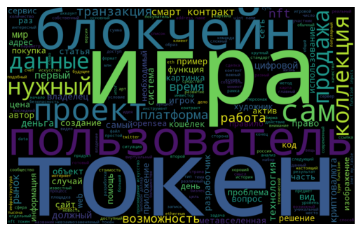

# ДЗ Обработка и анализ текста

Анализировались статьи на тему NFT, набранные на предыдущем этапе задания. Статьи, найденные в Google Scholar, решил не добавлять в облако тегов, т.к. они на английском.

## Авторы

В файле `authors.ipynb` можно посмотреть основных авторов для каждого анализируемого источника:

### Habr

| Никнейм        | Количество |
|----------------|------------|
| AnnieBronson   | 27         |
| maybe_elf      | 24         |
| daniilshat     | 18         |
| IgnatChuker    | 11         |
| ancotir        | 8          |
| RationalAnswer | 7          |
| avouner        | 4          |
| LizzieSimpson  | 4          |
| monomoto       | 4          |
| man_of_letters | 3          |

### Cyberleninka

| ФИО | Количество |
|----------------|------------|
| Седов Е.В. | 4 |
| Чеховской И.С. | 4 |
| Фатхи Валентина Игоревна | 3 |
| Лосева Ольга Владиславовна | 3 |
| Ситник А. А. | 2 |
| Turdialiev | 2 |
| Шилов Кирилл Дмитриевич | 2 |
| Коданева Светлана Игоревна | 2 |
| Федотова Марина Алексеевна | 2 |
| Качулин Д.И. | 2 |

### Google Scholar

| ФИО | Количество |
|----------------|------------|
| M Nadini | 3 |
| M Martino | 3 |
| D Yolanda | 3 |
| Y Wang | 3 |
| K Salah | 3 |
| Q Wang | 2 |
| L Ante | 2 |
| D Das | 2 |
| P Bose | 2 |
| C Kruegel | 2 |

## Облако тегов

С хабра брал текстовое содержание статьи за исключением блоков кода. С киберленинки использовал только аннотации.

В анализе участвовали `258` статей, состоящие в общей сложности из `1336152` символов.

Интересно, что в статьях про NFT, слово "игра" вышла в топ :)
